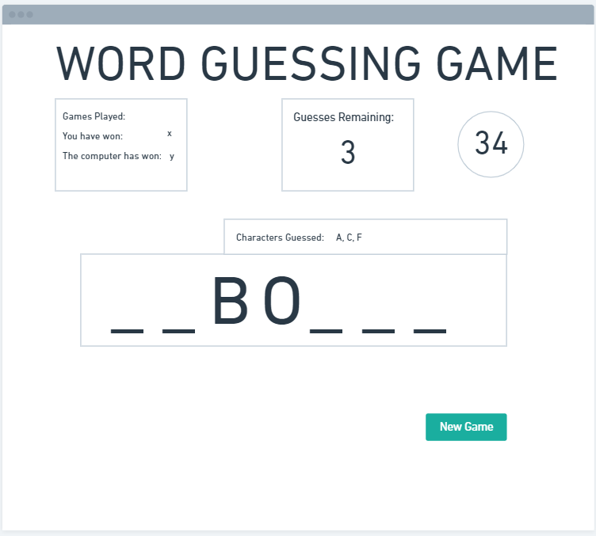

## Description
 
 * Build a word guessing game. 
 * Game
 * Random word appears
 * I have a minute to guess or the letters
 * or a max number of guesses

## Pseudo

1. Create Save Game Button
    * event listener that triggers a new word
1. Create function that generates a random word
    * output changes to new word and blanks
1. if user input (key stroke event?)
    * if correct letter, fill out blanks
        
    * else, numberOfGuesses -1
1. if matches === lettersInWord.length, i.e. the user has guessed all the letters
    * run a function whoWins
1. if timer=== 0 - run who wins
1. if numberofGuesses < 0 - run who wins

## Wireframe and HTML

HTML and Basic CSS to look something like the following:

[Link to Wireframe](https://whimsical.com/DULYExUd6Lm9hifgEqGp9o)

    

## CSS

* I will use .containers to contain all the little boxes
* stretched background of words or scrabble or something
* gradient on the boxes

## Potential Variables

| Variable          | Type          | code          | explanation                           |
| ------------      | -----         | ------------  | -------------                         |
| gamesPlayed       | number        | init to 0     | Games played tally                    |
| winCount          | number        | init to 0     | Games won tally                       |
| lossCount         | number        | init to 0     | Games Lost tally
| numberOfGuesses   | number        |               | Number of guesses the user has left   |
| theWord              | string        |               | Word to be guessed                    |
| lettersinWord     | array         | word.split()  | Each Letter in the word               |
| matches           | number        |               | Number of matches user has found      |
| getWord()         | function      |               | returns a random word                 |
| whoWins()         | function      |               | called when game over. returns output of winner. updates count scores |
| countdown()       | function      | setInterval   | decreases timer -- each second        |
| JSON words?       | JSON          |               | list of different words               |

## User events:
* enter the letter?
* keyboard - click event for each?
* newGame
    
    
## Outputs:

* blanks or letters depending on where we are up to in the game
* win count
* loss count
    
